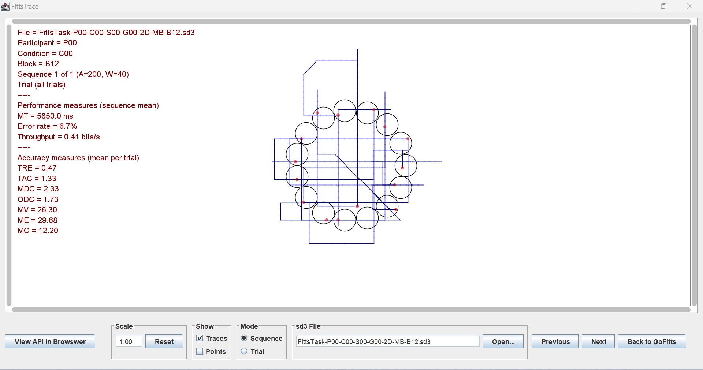
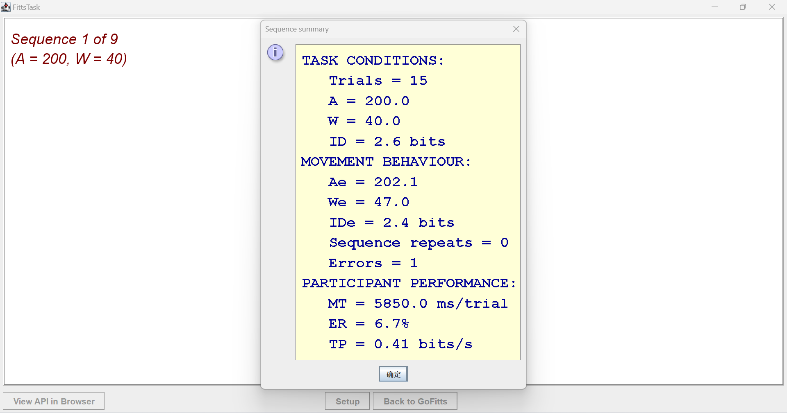

# Projekt Dokumentation

## Kurzbeschreibung Klient

### Klient: Gerald
Gerald ist ein Grafikdesigner, der präzise und effiziente Eingabemethoden für seine digitale Kunst benötigt. Seine Fähigkeit, traditionelle Eingabegeräte zu nutzen, ist eingeschränkt, daher erfordert sein Arbeitsablauf maßgeschneiderte Lösungen.

## Verwendete Komponenten

### Hardware
- **Fabi**: Ein barrierefreies Eingabegerät, das speziell für Benutzer mit eingeschränkter Motorik entwickelt wurde.
- **Taster**: Ein Schalter, der es dem Benutzer ermöglicht, ohne feinmotorische Fähigkeiten Eingaben zu tätigen.
- **FlipMouse**: Ein vielseitiges Eingabegerät, das durch minimale Kopf- oder Mundbewegungen gesteuert wird.

### Software
- **GoFitts**: Ein Tool zur Durchführung und Auswertung von FittsTask2D-Tests.

## Nachvollziehbarkeit der Inbetriebnahme

Die Inbetriebnahme der Eingabegeräte erfolgt in folgenden Schritten:

1. Fabi-Gerät über USB anschließen.
2. Taster mit dem Fabi-Gerät verbinden.
3. FlipMouse gemäß den ergonomischen Anforderungen des Benutzers positionieren.
4. GoFitts-Software für die Testdurchführung installieren.

## Bedienung mit vorhandenen Möglichkeiten

Gerald nutzt das Fabi-Gerät und den Taster für Basisfunktionen und die FlipMouse für feinere Bewegungen. Die GoFitts-Software bietet eine visuelle Schnittstelle zur Messung der Eingabeeffizienz.

## Verwendung von mindestens 2 verschiedenen Eingabegeräten

Für den Test wurden sowohl das Fabi-Gerät als auch die FlipMouse eingesetzt. Die FlipMouse erwies sich als besonders geeignet für Aufgaben, die eine hohe Präzision erfordern, während das Fabi-Gerät in Verbindung mit dem Taster für schnellere, wiederholende Eingaben ideal war.

## Ergebnis FittsTask2D

Die Ergebnisse des FittsTask2D-Tests sind wie folgt:

### Path Diagram

### Performance Metrics (Beste Sequenz)
- **Mean Time (MT)**: 5850.0 ms
- **Error Rate (ER)**: 6.7%
- **Throughput**: 0.41 bits/s

### Accuracy Measures
- **Total Error Rate (TRE)**: 0.47
- **Target Acquisition Time (TAC)**: 1.33
- **Mean Deviation from Center (MDC)**: 2.33
- **Orthogonal Deviation (ODC)**: 1.73
- **Movement Variability (MV)**: 26.30
- **Movement Error (ME)**: 29.68
- **Movement Offset (MO)**: 12.20

### Task Conditions Summary

## Schlussfolgerung

Die erzielten Werte zeigen, dass die gewählten Eingabemethoden eine effektive Steuerung ermöglichen. Allerdings gibt es noch Verbesserungspotenzial, um die Fehlerquote zu reduzieren und die Effizienz weiter zu erhöhen.
